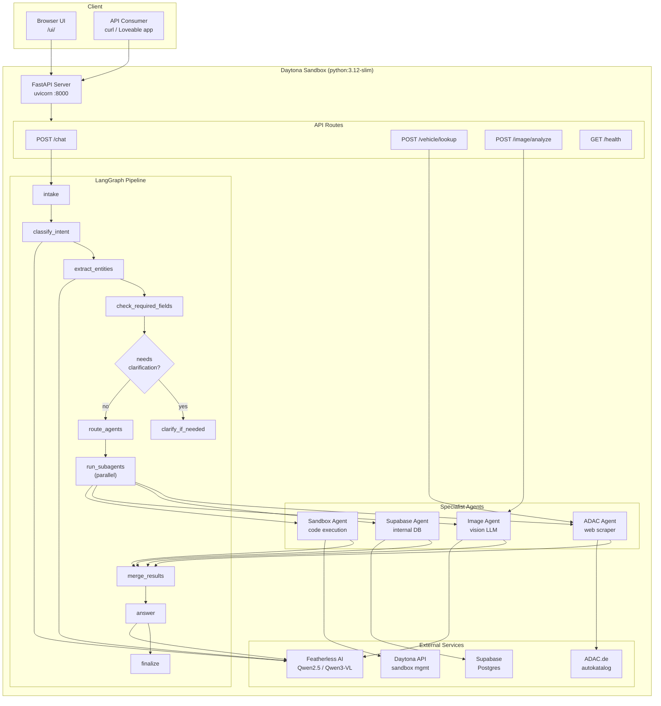
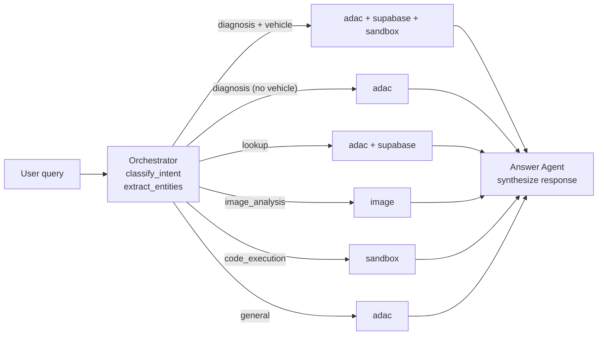
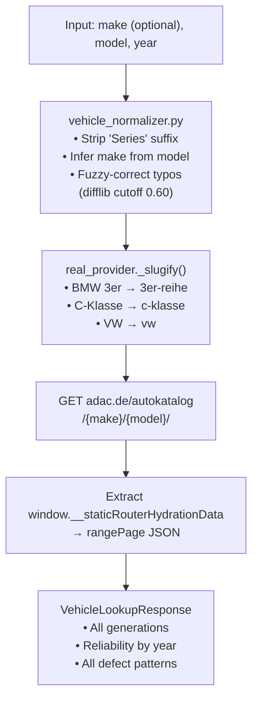
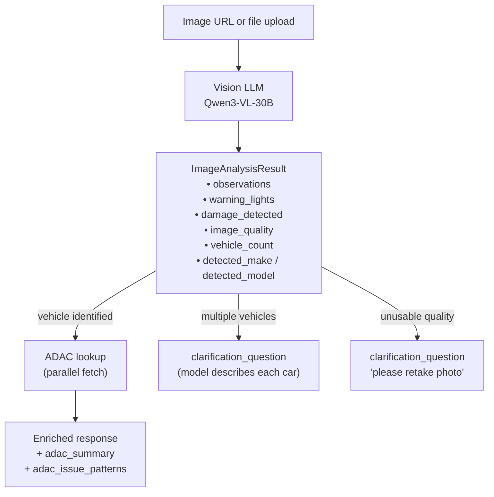

# Carlover — Architecture & Agent Workflow

## Overview

Carlover is a multi-agent automotive assistant built on **LangGraph** and deployed on **Daytona**. A user request flows through an orchestration pipeline that classifies intent, extracts vehicle entities, runs specialist agents in parallel, and synthesizes a final answer.

---

## Daytona Deployment Workflow

---

## Agent Descriptions

| Agent | Trigger | What it does |
|---|---|---|
| **ADAC Agent** | `diagnosis`, `lookup`, always for `/vehicle/lookup` | Scrapes adac.de autokatalog, extracts JSON hydration data, returns all generations + year-by-year Pannenstatistik + defect patterns |
| **Supabase Agent** | `diagnosis`, `lookup` | Queries internal Postgres for vehicle weaknesses and past service cases |
| **Image Agent** | Any request with `image_url`, or `image_analysis` intent | Vision LLM analyzes photo → observations, warning lights, damage; auto-fetches ADAC data if vehicle is identified |
| **Sandbox Agent** | `code_execution` intent or `diagnosis` with vehicle | Spins up a Daytona ephemeral sandbox, runs diagnostic Python, returns output |

---

## Intent → Agent Routing

---

## Vehicle Lookup Flow (fuzzy matching)

---

## Image Analysis Flow

---

## Key Design Decisions

- **Parallel agents** — `asyncio.gather(return_exceptions=True)` so one agent failure doesn't abort the pipeline
- **Fuzzy matching** — `difflib.get_close_matches` with 0.60 cutoff handles typos; `MODEL_TO_BRAND` handles brand-less input
- **ADAC scraping** — extracts embedded JSON (`window.__staticRouterHydrationData`) from server-rendered pages; 24h in-memory cache; 1s rate-limit delay
- **LLM structured output** — all LLM calls use `method="json_mode"` (required for Featherless/vLLM backend)
- **Daytona** — each deployment creates a new sandbox; the Sandbox Agent creates ephemeral 5-minute sandboxes for code execution
